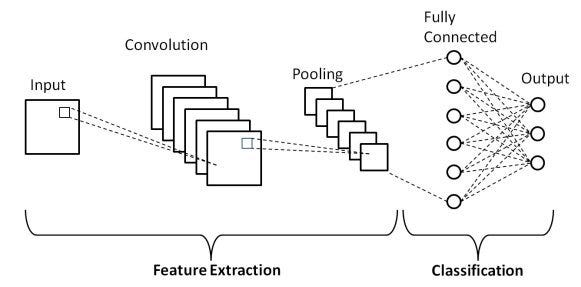

# Convolutional Neural Networks (CNN) – Fashion MNIST

This folder contains implementations of **Convolutional Neural Networks (CNNs)** using **PyTorch**, applied to the **Fashion-MNIST** dataset.

The focus is on transitioning from fully connected ANNs to CNNs, understanding convolutional feature extraction, and training models efficiently using GPU acceleration.

> General CNN Architecture:



<!-- --- -->

## Contents

### 1. CNN with GPU Acceleration
**Notebook:** `01-cnn-fashion-mnist-gpu.ipynb`

- Uses raw Fashion-MNIST CSV data
- Reshapes flat image vectors into `1×28×28` tensors
- Custom `Dataset` and `DataLoader`
- CNN architecture with:
  - Convolution layers
  - Batch Normalization
  - Max Pooling
  - Dropout for regularization
- Fully connected classifier head
- Trained using **SGD with weight decay**
- Evaluated on train and test sets

### 2. CNN with Optuna Hyperparameter Optimization
**Notebook:** `02-cnn-fashion-mnist-gpu-optuna.ipynb`

- Builds a dynamic CNN architecture driven by Optuna
- Uses the same Fashion-MNIST preprocessing pipeline with GPU support
- Introduces **automated hyperparameter tuning**, including:
  - Number of convolutional layers
  - Number of filters per layer
  - Kernel size
  - Number of fully connected layers
  - Fully connected layer size
  - Dropout rate
  - Optimizer choice (Adam, SGD, RMSprop)
  - Learning rate
  - Batch size
  - L2 regularization (`weight_decay`)
- Separates concerns clearly:
  - Model definition (`DynamicCNN`)
  - Training loop
  - Evaluation logic
  - Optuna objective function
- Uses **Median Pruner** to stop underperforming trials early
- Final model is **retrained from scratch** using the best Optuna parameters
- Reports final **train and test accuracy**

<!-- --- -->

## Dataset

This project uses the **Fashion-MNIST** dataset.

⚠️ The dataset file is **not included** in the repository due to GitHub file size limits.
- Please download: `fashion-mnist_train.csv`
- From Kaggle: https://www.kaggle.com/datasets/zalando-research/fashionmnist
- Place the CSV file in the same directory as the notebook before running.

<!-- --- -->

## Key Concepts Covered

- CNN fundamentals in PyTorch
- `Conv2d`, `BatchNorm2d`, `MaxPool2d`
- Image tensor reshaping for CNNs
- GPU-based training workflow
- Regularization using Dropout and L2 weight decay
- Modular CNN design (`features` + `classifier`)

<!-- --- -->

## Requirements

Install dependencies using:
  ```bash
  pip install -r requirements.txt
  ```
> GPU support requires a CUDA-enabled PyTorch installation.
