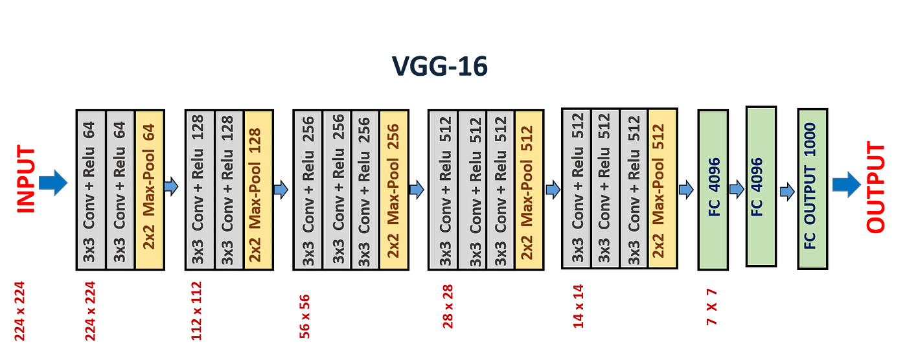

# Transfer Learning – Fashion MNIST (VGG16)

This folder demonstrates **transfer learning using a pretrained VGG16 model** in PyTorch, applied to the **Fashion-MNIST** dataset.

The goal of this module is to understand how pretrained CNNs (trained on ImageNet) can be adapted to new tasks with limited data by:
- Reusing learned convolutional features
- Freezing backbone layers
- Training a custom classifier head

> VGG16 Model Architecture:



<!-- --- -->

## Notebook

### Transfer Learning with VGG16 (GPU)
**Notebook:** `transfer-learning-fashion-mnist-gpu.ipynb`

Key steps covered:
- Loading Fashion-MNIST from CSV format
- Converting grayscale images to 3-channel RGB
- Applying **ImageNet-standard preprocessing**
- Using pretrained **VGG16**
- Freezing convolutional layers
- Replacing and training a custom classifier
- GPU-accelerated training and evaluation

<!-- --- -->

## Dataset

This project uses the **Fashion-MNIST** dataset.

⚠️ The dataset file is **not included** in the repository due to GitHub file size limits.

**Required file:**
- `fashion-mnist_train.csv`
- Download from Kaggle: https://www.kaggle.com/datasets/zalando-research/fashionmnist
- Place the CSV file in this folder before running the notebook.

<!-- --- -->

## Model Details

- Backbone: **VGG16 (pretrained on ImageNet)**
- Frozen layers: `vgg16.features`
- Trainable layers: Custom classifier head
- Input size: `3 × 224 × 224`
- Loss: `CrossEntropyLoss`
- Optimizer: `Adam` (classifier only)

<!-- --- -->

## Key Concepts Covered

- Transfer learning fundamentals
- Feature extraction vs fine-tuning
- Freezing model parameters
- Image preprocessing for pretrained models
- Grayscale → RGB conversion
- ImageNet normalization
- Efficient GPU training

<!-- --- -->

## Requirements

Install dependencies using:
  ```bash
  pip install -r requirements.txt
  ```
> GPU support requires a CUDA-enabled PyTorch installation.
