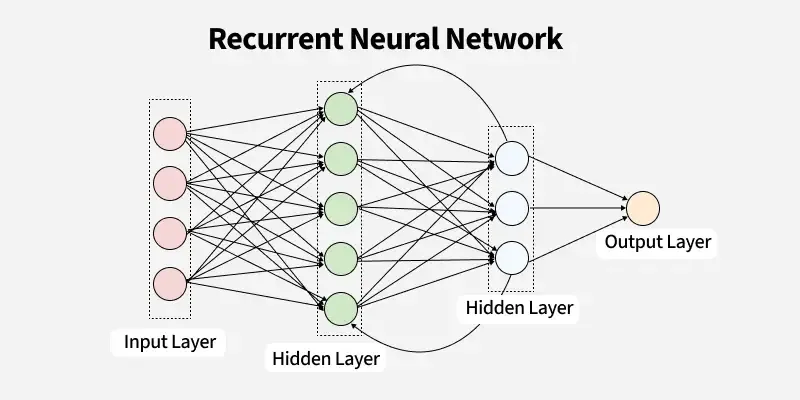

# Recurrent Neural Network (RNN) – Question Answering

This folder contains a **from-scratch implementation of a simple RNN-based Question Answering (QA) system** using **PyTorch**.

The goal of this module is to understand how **sequence models** work internally — including tokenization, vocabulary building, embeddings, and recurrent computation — without relying on high-level NLP libraries.

> RNN Model Architecture:



<!-- --- -->

## Contents

### 1. RNN-Based QA System
**Notebook:** `rnn-based-qa-system.ipynb`

- Text preprocessing and tokenization
- Vocabulary construction with `<UNK>` handling
- Conversion of text to numerical sequences
- Custom `Dataset` and `DataLoader`
- RNN-based sequence model using:
  - `nn.Embedding`
  - `nn.RNN`
  - Fully connected output layer
- Manual training loop
- Simple inference function for question answering

<!-- --- -->

## Dataset

*File:** `100_Unique_QA_Dataset.csv`
- Small handcrafted Question–Answer dataset
- Used for educational purposes
- Each row contains:
  - `question`
  - `answer`

This dataset is intentionally small to keep training fast and to focus on **model mechanics**, not performance.

<!-- --- -->

### Key Concepts Covered

- Tokenization and vocabulary building
- Word-to-index mapping
- Handling unknown words (`UNK`)
- Sequence modeling with RNNs
- Embedding layers in NLP
- Why `nn.Sequential` is **not suitable** for RNNs
- Training sequence models from scratch
- Basic text inference pipeline

<!-- --- -->

## Requirements

Install dependencies using:
  ```bash
  pip install -r requirements.txt
  ```
> GPU support requires a CUDA-enabled PyTorch installation.
