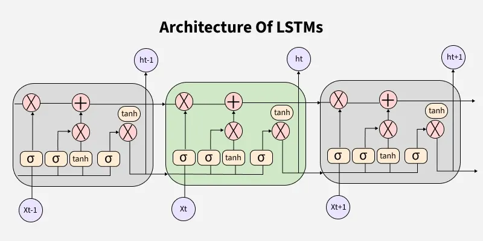

# LSTM – Next Word Prediction

This folder contains an implementation of a **Next-Word Prediction model** using **LSTM (Long Short-Term Memory)** networks in **PyTorch**.

The notebook demonstrates how sequence models learn language structure by predicting the next token given a partial sentence, forming the foundation of modern language models.

> LSTM Model Architecture:



<!-- --- -->

## Contents

### 1. LSTM Next-Word Predictor
**Notebook:** `lstm-next-word-predictor.ipynb`

- Text loaded from an external file (`document.txt`)
- Tokenization using **NLTK**
- Vocabulary construction with an `UNK` token
- Conversion of text into numerical sequences
- Sliding-window sequence generation for language modeling
- Padding for variable-length sequences
- LSTM-based model with:
  - Embedding layer
  - LSTM encoder
  - Fully connected output layer
- Trained using **CrossEntropyLoss**
- Autoregressive text generation (next-word prediction)

<!-- --- -->

## Dataset

- **File:** `document.txt`
- Plain text used for language modeling
- Each line treated as an independent sentence

<!-- --- -->

## Key Concepts Covered

- Tokenization and vocabulary building
- Sequence-to-label dataset construction
- Padding and sequence alignment
- LSTM internals (hidden state & cell state)
- Next-token prediction
- Autoregressive text generation
- Difference between RNN and LSTM

<!-- --- -->

## Requirements

Install dependencies using:
  ```bash
  pip install -r requirements.txt
  ```

> GPU acceleration is optional but supported if PyTorch is CUDA-enabled.